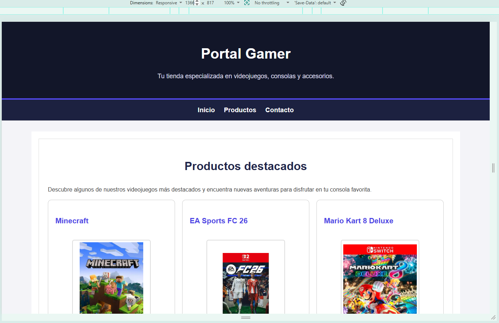
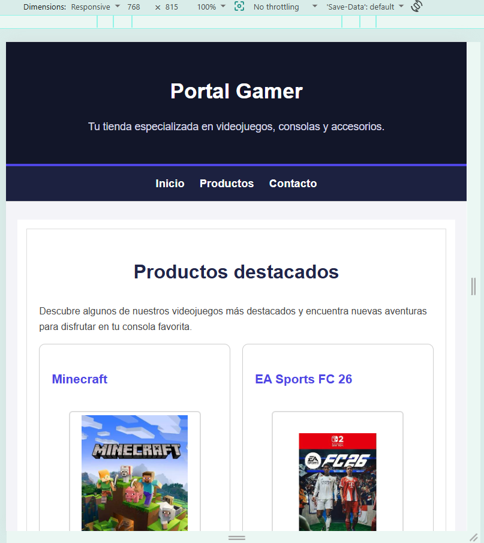
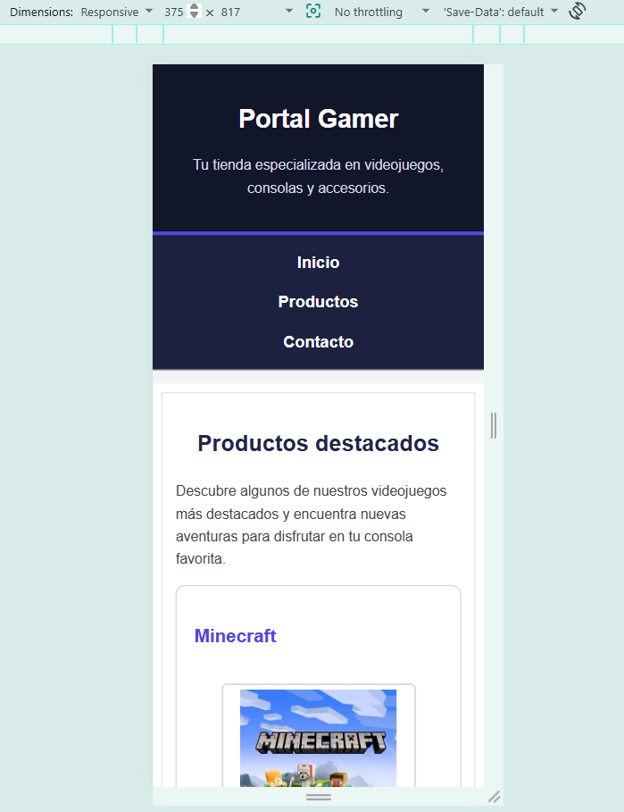
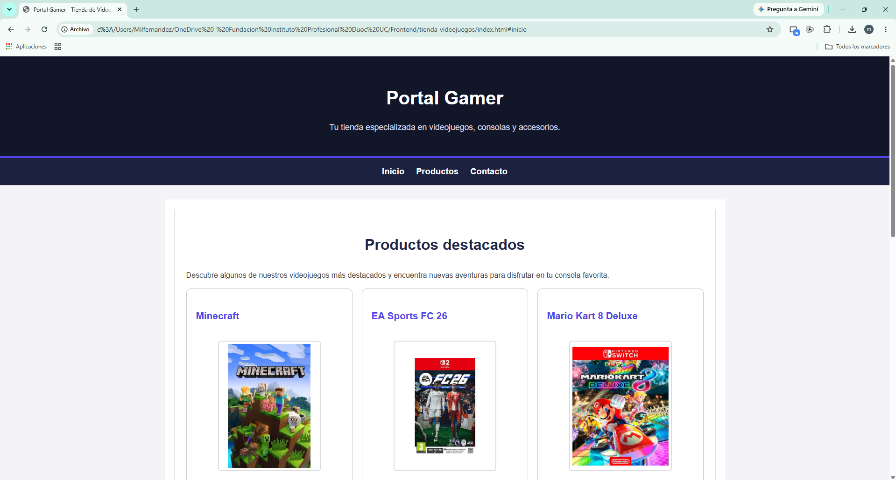
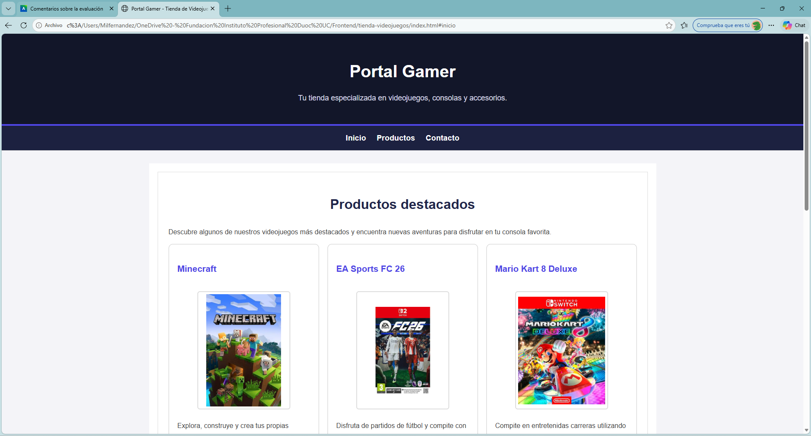
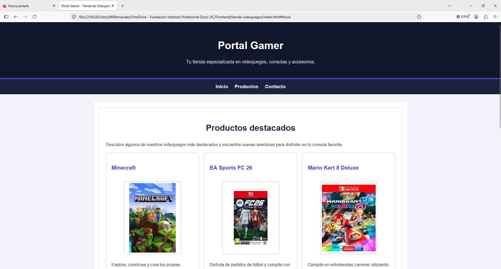

# Portal Gamer - Sumativa Semana 3

Proyecto desarrollado para la asignatura Desarrollo Frontend I.

El objetivo de esta actividad es optimizar el diseño responsivo del sitio web Portal Gamer mediante CSS, utilizando Flexbox, CSS Grid y media queries.

## Tecnologías utilizadas

- HTML5
- CSS3
- Flexbox
- CSS Grid
- Media Queries
- Git y GitHub
- GitHub Pages

## Diseño responsivo

El sitio fue probado en diferentes resoluciones para comprobar su correcta adaptación.

### Escritorio - 1366 px

### Tablet - 768 px

### Móvil - 375 px

## Compatibilidad entre navegadores

El sitio fue probado en distintos navegadores para verificar que mantenga su estructura, estilos y funcionalidad.

### Google Chrome

### Microsoft Edge

### Mozilla Firefox

## Sitio publicado

GitHub Pages:

https://miliduoc.github.io/PFY2201-Semana3-Portal-Gamer/